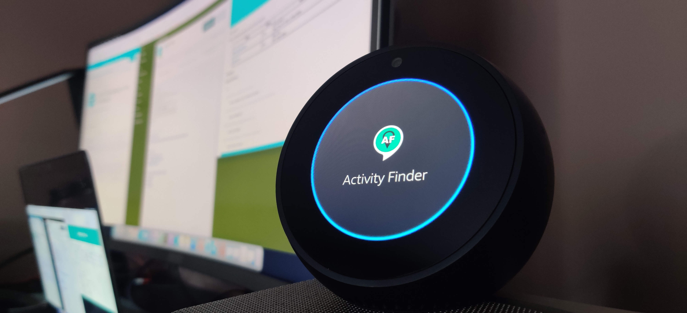
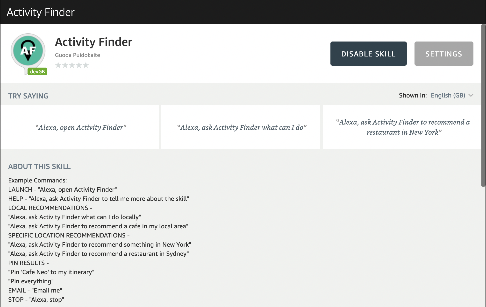
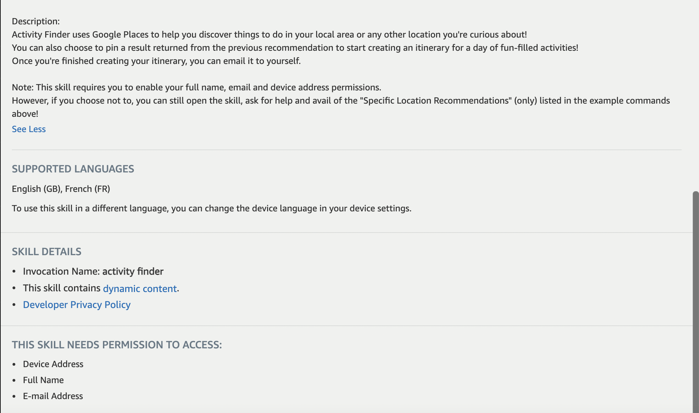
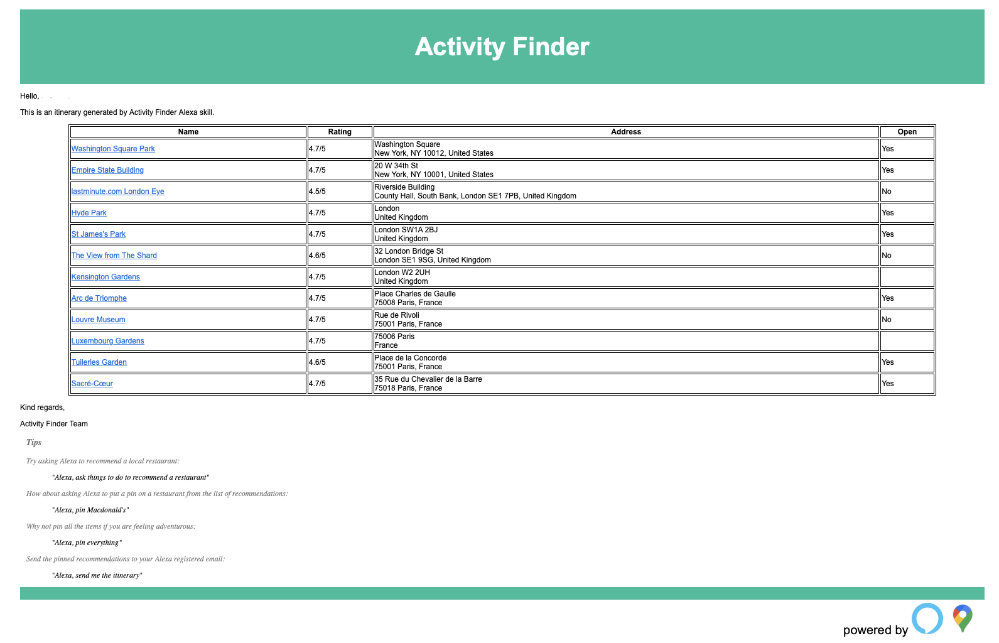

## Activity Finder Alexa Skill:

Activity Finder uses Google Places to help you discover things to do in your local area or any other location you're curious about!
You can also choose to pin a result returned from the previous recommendation to start creating an itinerary for a day of fun-filled activities!
Once you're finished creating your itinerary, you can email it to yourself. Please read the 'Amazon Marketplace Description' below to find out more.

## Project Demo:

https://www.linkedin.com/posts/activity-6778673345165627392-n_HA

## Amazon Marketplace Description:

The below description can be found when downloading Activity Finder from the Amazon Alexa Skill Marketplace. It describes what the skill does and suggests example commands to get you started.

## Example Email Generated:

The below image shows an example itinerary created by a user and sent to their email.

## User Testing Instuctions:

**_Testing has ended_**

1. Note: You can test on any Alexa device in your home connected to your Amazon account or download the free Alexa app and sign up.
2. Press on this direct beta test invitation link to download the skill: https://skills-store.amazon.com/deeplink/tvt/6a979d467d9a8a1ab6d768b17856ca5604e3d04dbaf364fa218166aed94870f53b0d0c717bee5564f6909430b1a21cdccf375056b9aefb9bd009da9fc4e6f23baf775881e69d1c7e9449dfec28a95dfebdf35437ccd9e34861a345a62957176c0e8ff2bd28babd14824e3b2e225db189
3. Enable all requested permissions.
4. Make sure that you have the full device address set before trying to test it in ‘Settings, device settings, Alexa on the phone (or whatever device you’re using), device address’. There's a reported bug that happens if you do not.
5. Make sure that you have 0 live ‘Enabled’ Activity Finder skills and only 1 ‘Dev’ Activity Finder skill. (Check this again if something goes wrong as sometimes Alexa downloads live skills instead of the Dev one)
6. Read the skill's instructions before you use it just to get familiar… as I hope a user would.
7. You can find skill permissions, skill instructions and the list of Enabled and Dev skills in the mobile app (for the instructions above) if you go to ‘More -> skills and games -> your skills -> dev tab or enabled tab -> activity finder skill’

## Local Debugging Instructions (Mac OS):

- To start degbugging the process locally, you will need to downloand 'ngrok' (https://ngrok.com/download). This will allow you to forward your requests from Alexa development suite to your local machine.
- Create an account on the website to retrieve a authentication token.
- Once you have it downloaded, use the below command to unzip it:

  `unzip path/to/ngrok.zip`

- After you unzip it, we need to apply the authentication token which can be found under Authentication -> Your Authtoken. Copy the token and then paste it into the below command (replace {authtoken} with your token):

  `./ngrok authtoken {authtoken}`

- Now that you have set up your ngrok, you will need to start it up. You can start it by running the below command:

  `./ngrok http 3001`

- When started, it will populate your terminal with with some information, but you need to copy the HTTPS link it provides for Forwarding. Copy that link. This will be used by Alexa Developer Console to send the commands to this instance instead of using its own.
- Go to your Alexa Developer Console. Once there, go to Build -> Endpoint. Select the HTTPS checkbox which will open some text fields. That link I mentioned to copy, we need to paste that link into 'Default Region'.
- Under that text box there is a dropdown which gives you 3 options. Pick the "My development endpoint is a sub-domain of a domain that has a wildcard certificate from a certificate authority" value.
- Click on 'Save Endpoints' to save your settings.
- Finally, we will double check that 'Development' is selected under "Skill testing is enabled". This can be found under the "Test" tab.
- You can now go ahead and start to test your code as you normally would through Alexa Developer Console.

## Folder Structure:

Root: Alexa Activity Finder

- assets (Alexa skill icons for en-GB & fr-FR locales)
- images (Contains images for the README file)
- interactionModels (Alexa's interaction models associating sample utterances to the targeted intents)
- lambda (Root folder of the skill containing the index.js file and package.json)
  - documents (Details for displaying the speech responses on devices with a UI e.g. Amazon Echo Spot)
  - lib (The main logic of the Alexa skill backend which carries out the translations, querying Google Places, handlers for the intents etc.)
  - models (The models associating sample utterances to the targeted intents (when debugging locally)
  - resources (Contains the configuration file for setting up the email and Google API (_need to add your own_). Also has the email base HTML file which creates the email message.)
- test
  - e2e (Contains the tests for end to end workflows)
  - unit (Contains the tests for unit testing functions)
- test_output
  - coverage (Contains the results and other test specific files for generating reports)
  - report (Contains the report of the test outcomes)
